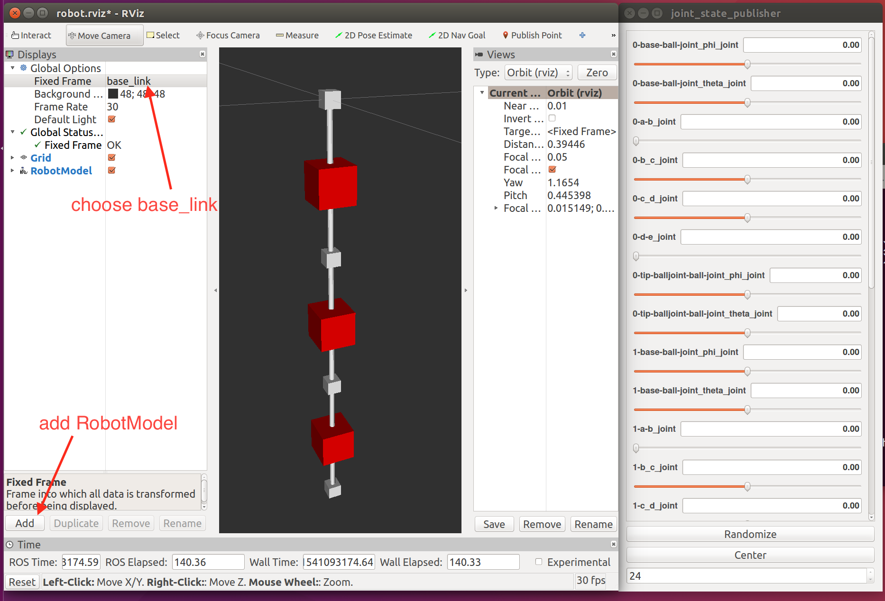
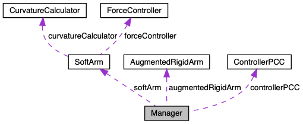

# Soft Trunk repository
# Fabrication of Physical Soft Robot
See **Soft Robot Fabrication.md**

# Bill of materials
See **Bill of materials.csv**

# How to set up software for new arm
1. set parameters
    1. Parameters of arm is defined in *SoftTrunk_common_defs.h* in include/ directory.
1. create URDF files
    1. run ./create_xacro in SoftTrunk/ directory to create the URDF XACRO(URDF but with macros) files for robot, *robot.urdf.xacro*, inside urdf/ directory.
    1. run ./create_urdf.sh in /urdf directory to create the URDF file, robot.urdf (which combines robot.urdf.xacro and macro_definitions.urdf.xacro). 
    This requires the [ROS XACRO](http://wiki.ros.org/xacro) package. (This package should be included in a standard [ROS installation](http://wiki.ros.org/kinetic/Installation/Ubuntu). If not, set up the sources.list and keys as written on the webpage, then `sudo apt install ros-kinetic-xacro`).
    1. The generated URDF file can be previewed with `roslaunch rviz.launch` in the /urdf directory
        1. add RobotModel, and choose base_frame as fixed frame to view robot. (By pressing ctrl-s in RVIZ, this configuration will be saved and you won't have to do it again)
        
1. run characterization process and update values with the results
1. run experiment

# OS
Works on Ubuntu and macOS. On macOS, the ROS features are unavailable- therefore, the XACRO -> URDF conversion must be done on a Linux machine with ROS installed. It is also impossible to preview the URDF with Rviz.

# Documentation with Doxygen
Uses Doxygen to generate documentation from inline comments in code.
Install [Doxygen](http://www.doxygen.nl), and run `doxygen` in this directory to generate HTML(can be seen with browser at html/index.html) & LATEX output.
The HTML output is included in git for convenience, but please be aware that it may be out of date. 
[GraphViz](https://www.graphviz.org/download/) is required if you want to generate depecdency graphs. 

This is the "collaboration diagram" for the Manager class(topmost class for control of the robot):


A good starting point is experiment.cpp, the Manager class, and SoftTrunk_common_defs.h

# Installing necessary libraries
## boost
boost extends C++ features. On Ubuntu, install from [boost](https://www.boost.org/), on macOS, do `brew install boost`

## pkg-config
helps manage libraries or something. On macOS,
```
brew install pkg-config
```

## libmodbus
Used for communication to FESTO valve array via modbus. For Ubuntu, 
```
echo "for Ubuntu"
sudo apt install libmodbus-dev

echo "for macOS"
brew install libmodbus
```

## NatNetLinux
This linux library is needed for listening to a udp communication from Optitrack Motive 1.10.0 on a windows machine and streaming rigid bodies. Ensure you install the [Prerequisites](https://github.com/rocketman768/NatNetLinux) for NatNetLinux.
In the /3rd directory(which is in the root of this repository), NatNetLinux is added as a submodule. After fetching the submodule with:
```
git submodule init
git submodule update
```
compile and install NatNetLinux. In the /build directory of the repository, run:
```
mkdir build
cd build
cmake ../NatNetLinux
make
sudo make install
```
## Eigen3
[Get the code](http://eigen.tuxfamily.org/index.php?title=Main_Page), unzip, navigate into the unzipped folder, prepare with cmake and then install this header libary:
```
mkdir build
cd build/
cmake ..
sudo make install
```

## RBDL
This code uses the [Rigid Body Dynamics Library](https://rbdl.bitbucket.io/index.html) for calculating the dynamics of the rigid bodies of the augmented robot model.
Download the most recent stable version as zip file, then follow its README to install, but make sure to also compile the URDF reader addon. Run in rbdl's directory:
```
mkdir build
cd build/
cmake -D RBDL_BUILD_ADDON_URDFREADER=ON CMAKE_BUILD_TYPE=Release ../
make
sudo make install
```
You need to install Eigen3 before installing RBDL.