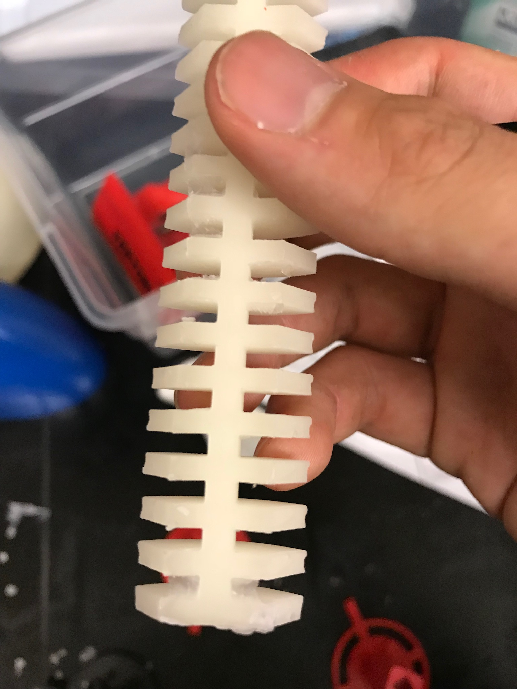
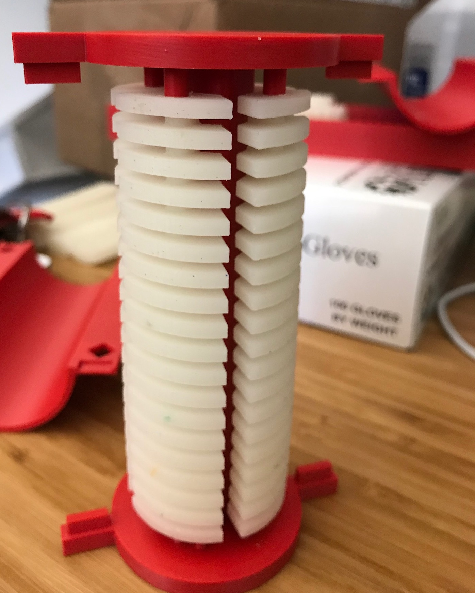
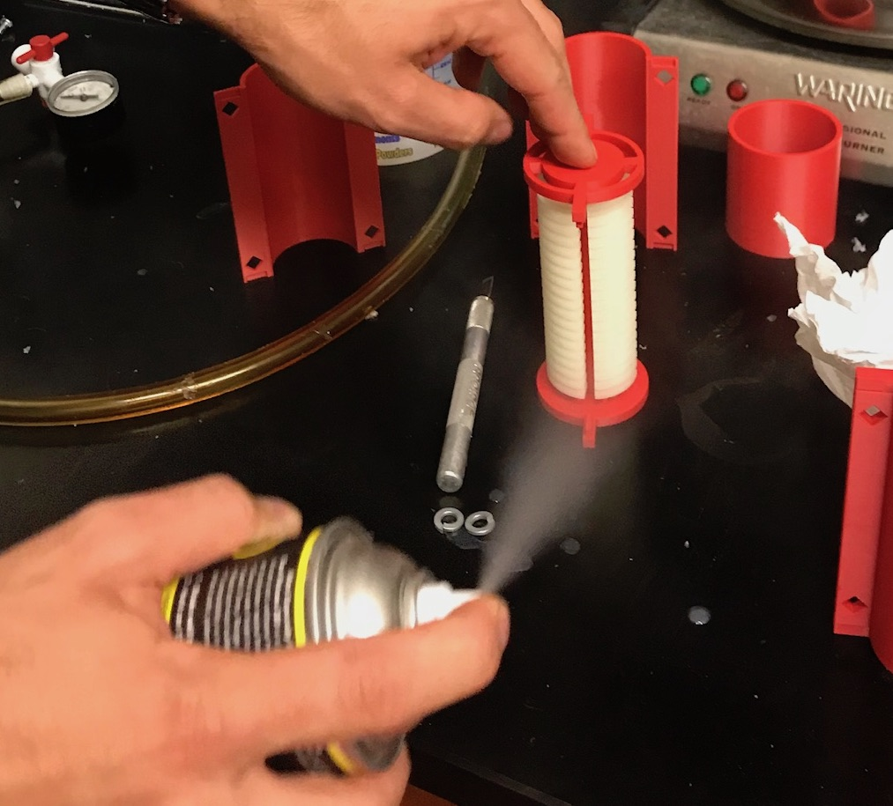
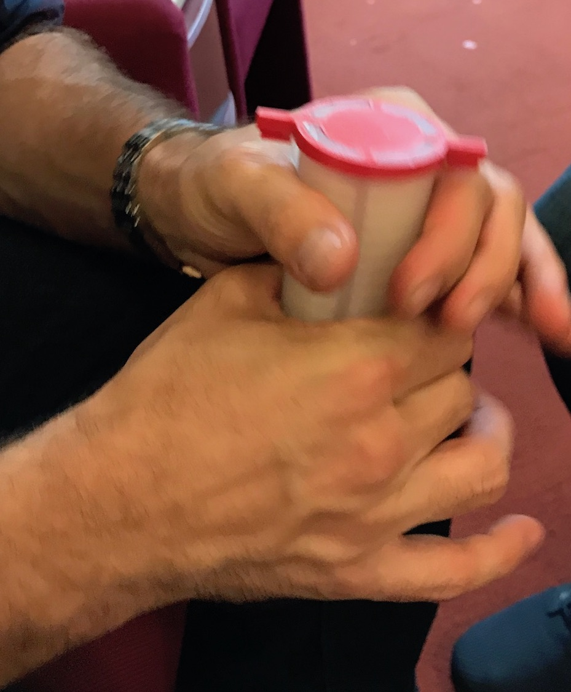

Steps to fabricate the soft trunk
# silicon casting
1. Assemble mold, if casting the final arm piece
    1. make sure the wax mold doesn't have rough edges
    
    a not-so-clean wax mold
    1. assemble them to make final structure (will probably need to shave off fraction of mm into the holes of wax to make them fit)
    
    assembled mold
    
    make sure wax pieces form a circle
1. make mix
    1. stir ingredients well before mixing (obviously, use separate stirrers!)
    1. **degas**
        1. put in vacuum chamber
        1. turn on pump
        1. twist valve to vacuum air out
        1. and keep turning them on and off to prevent overflowing
        1. do until bubbles subside
        1. turn off pump, slowly pressurize
    1. weigh equal amounts of ingredients(use zero button on scale)
    1. mix well (instructions say to mix for 2-3 minutes)
    1. degas the mixed silicone
1. Spray Ease-Release on mold

1. pour silicon onto mold
    1. pour slowly, a little below top surface (so it won't overflow in vacuum chamber)
    1. degas
        1. if making final arm piece, degas for ~30 minutes to ensure bubbles are gone
    1. place on desk, pour again and go slightly over the top
    1. slide over with ruler or something to make top flush
1. let it sleep for as long as silicon wants
1. take it out (some technique required)

    * for the cast for the wax mold, (what good technique is there to release from mold??)
    * for final arm piece, twist it around to loosen it
    

# wax casting
1. warm stuff up
    1. heat oven to 92 degrees Celcius
    1. generate molten wax from block of wax (break up with hammer if necessary)(place so it won't melt to outside cup)
    1. Put silicon mold in oven as well (~15 minutes)
1. align silicon mold with something to make sure it's straight
1. inject wax
    1. take out jar with wax and syringe(use gloves!)
    1. inject to mold, slightly overfilling it
    
    1. syringe will clog if out too long (put back in jar if that happens, to warm it up)
1. make flush
    1. after 10 minutes, use blade to cut wax flush with top surface of mold
    
1. should be cooled down in about 30 minutes
1. carefully take them out(once it's not warm anymore, which is about 40 minutes? **Don't wait till they're too cold**- they'll become too brittle and break easily) and handle with care
1. If there's some deforming (twists, bends), try to correct it...

# vanishing wax and cleaning
1. Put arm in oven supported by aluminum shafts, with aluminum plate below to catch molten wax
1. put in boiling water
1. clean with water- run water through holes
1. clean holes for tubing with wax remover, then wipe it off with q-tips(use gloves!)
1. clean holes for tubing with alcohol

# tubing
1. make sure holes are cleaned with wax remover and alcohol
1. put silicon glue on both the hole(use q-tips) and tube(on all the surface that bonds to main piece)- use kimwipes
1. insert
    1. make sure the plugs are flush
    1. insert about 1 cm
    1. 12 inches (30cm) of slack for air tubing

# Using 3D printer
## Solidworks
Export STL
* The mold for wax mold is in ConfigurationManager -> Quad Mold Mold

## Insight
insert STL -> orient STL

In Modeler setup,
* part interior style: solid
* visible surface style: enhanced
* support style: SMART

then "slice", then check that it looks fine. Finally, "finish" to write out the sliced files.

## Control Center
select printer, insert CMB, build job
